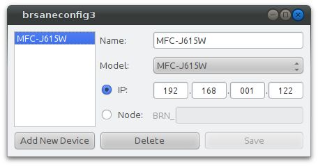

GUI for Brother's brsaneconfig3 utility
=====
> NOTE: This project is in no way affiliated with or endorsed by Brother International Corporation

This is a basic Python/Qt GUI for Brother's `brsaneconfig3` utility that simply executes the command with arguments corresponding to what the user enters.

Dependencies
-----
* Python (written for 2.7, might work with 3.x)
* PyQt4
* [brsaneconfig3](http://welcome.solutions.brother.com/bsc/public_s/id/linux/en/instruction_scn1.html)